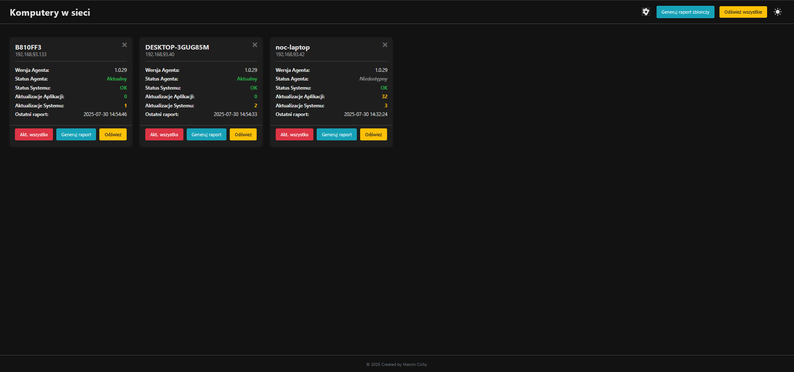

Winget Dashboard - Centralne Zarządzanie Oprogramowaniem

## Screenshot

Winget Dashboard to aplikacja webowa oparta na frameworku Flask, przeznaczona do zdalnego monitorowania i zarządzania oprogramowaniem na komputerach z systemem Windows przy użyciu menedżera pakietów winget. Projekt został stworzony z myślą o małych i średnich zespołach IT, które potrzebują prostego narzędzia do centralizacji aktualizacji, deinstalacji i raportowania stanu stacji roboczych.
Główne Funkcje

    Centralny Panel: Przegląd wszystkich podłączonych komputerów wraz z ich statusem (online, wymagany restart, wersja agenta).

    Szczegółowy Widok Komputera: Dostęp do listy zainstalowanych aplikacji, dostępnych aktualizacji oprogramowania oraz aktualizacji systemu Windows.

    Zdalne Akcje: Możliwość zdalnego zlecania zadań:

        Aktualizacja: aplikacji lub całego systemu operacyjnego.

        Deinstalacja: dowolnej aplikacji (w tym aplikacji ze Sklepu Windows).

        Tryb "Poproś" vs "Wymuś": Zadania mogą być wykonywane w trybie interaktywnym (z prośbą o zgodę użytkownika) lub cichym (wymuszonym).

    Generator Agenta: Wbudowane narzędzie w panelu webowym do tworzenia spersonalizowanego pliku agent.exe z wpisaną konfiguracją.

    Automatyczna Aktualizacja Agenta: Możliwość zdalnego wdrożenia nowej wersji agenta na wszystkich komputerach.

    Czarna Lista (Blacklist): Możliwość zdefiniowania globalnej lub indywidualnej dla komputera listy słów kluczowych, aby ignorować określone aplikacje.

    Historia Raportów: Dostęp do historycznych raportów dla każdej maszyny.

    Interaktywność: Agent potrafi wyświetlać okna dialogowe w sesji zalogowanego użytkownika, prosząc go o podjęcie decyzji.

Architektura

System składa się z trzech głównych komponentów klienckich, które współpracują z centralnym serwerem.

    Serwer (Flask): Sercem aplikacji jest serwer napisany w Pythonie z użyciem Flask. Odpowiada za udostępnianie panelu webowego, API do komunikacji z agentami, zarządzanie bazą danych (SQLite) oraz generowanie plików wykonywalnych głównego agenta.

    Agent (agent.exe): Program działający jako usługa systemowa Windows (Windows Service) na komputerach klienckich. Jego zadania to cykliczne raportowanie do serwera, pobieranie i wykonywanie zadań oraz komunikacja z Pomocnikiem UI.

    Pomocnik UI (ui_helper.exe): Lekki program pośredniczący, uruchamiany w kontekście zalogowanego użytkownika. Jest niezbędny, aby ominąć tzw. "Session 0 Isolation", co pozwala agentowi na wyświetlanie okien dialogowych na pulpicie.

    Updater (updater.exe): Specjalistyczne narzędzie odpowiedzialne za proces autoaktualizacji agenta. Zatrzymuje starą usługę, podmienia plik .exe na nowy i uruchamia usługę ponownie.

Instalacja i Konfiguracja
Wymagania

    Python 3.8+

    Git

    pyinstaller do budowania komponentów klienckich.

1. Konfiguracja Serwera

# Sklonuj repozytorium
git clone <adres-twojego-repozytorium>
cd winget-dashboard

# Utwórz i aktywuj wirtualne środowisko
python -m venv venv
venv\Scripts\activate  # Windows

# Zainstaluj zależności
pip install -r requirements.txt

Utworzenie pliku .env

W głównym folderze projektu utwórz plik .env i uzupełnij go:

# Wygeneruj silny, losowy klucz. Możesz użyć: python -c 'import secrets; print(secrets.token_hex(16))'
SECRET_KEY=twoj_super_tajny_klucz_sesji

# Wygeneruj losowy klucz API, który będzie używany do autoryzacji agentów
API_KEY=twoj_super_tajny_klucz_api_dla_agentow

# Zainicjuj bazę danych (ten krok wykonaj tylko raz)
flask init-db

# Uruchom serwer (dewelopersko lub produkcyjnie)
flask run --host=0.0.0.0
# lub dla produkcji:
waitress-serve --host=0.0.0.0 --port=5000 run:app

2. Budowanie Komponentów Klienckich

Zanim wdrożysz agentów, musisz jednorazowo zbudować pliki ui_helper.exe i updater.exe ze źródeł. Główny plik agent.exe będzie generowany z panelu webowego.

# Będąc w głównym folderze projektu, wykonaj:
pyinstaller --onefile --noconsole --name ui_helper ui_helper.py
pyinstaller --onefile --name updater updater.py

Gotowe pliki .exe znajdziesz w nowo utworzonym folderze dist.
3. Generowanie Głównego Agenta (agent.exe)

    Otwórz panel webowy w przeglądarce (np. http://127.0.0.1:5000).

    Przejdź do zakładki "Ustawienia".

    W formularzu "Generator Agenta" podaj publiczny adres serwera oraz klucz API (ten sam co w pliku .env).

    Kliknij "Generuj agent.exe", aby pobrać spersonalizowany plik.

4. Wdrożenie na Komputerze Klienckim

    Utwórz folder na maszynie klienckiej, np. C:\Program Files\WingetAgent.

    Umieść w nim trzy pliki wykonywalne:

        agent.exe (pobrany z panelu w kroku 3).

        ui_helper.exe (zbudowany w kroku 2, z folderu dist).

        updater.exe (zbudowany w kroku 2, z folderu dist).

    Otwórz Wiersz polecenia (CMD) jako administrator, przejdź do folderu z agentem i wykonaj polecenia:

    # Instalacja usługi
    agent.exe install

    # Uruchomienie usługi
    agent.exe start

Agent jest teraz zainstalowany i po chwili powinien pojawić się w panelu.
Stos Technologiczny

    Backend: Python 3, Flask, SQLite

    Frontend: HTML5, CSS3, JavaScript

    Agent: Python 3, pywin32

    Narzędzia: PyInstaller

Winget Dashboard - Centralized Software Management (English Version)

Winget Dashboard is a Flask-based web application for remotely monitoring and managing software on Windows computers using the winget package manager. The project is designed for small to medium-sized IT teams who need a simple tool to centralize updates, uninstalls, and reporting for their workstations.
Key Features

    Central Dashboard: An overview of all connected computers with their status (online, reboot required, agent version).

    Detailed Computer View: Access to the list of installed applications, available software updates, and Windows Updates.

    Remote Actions: Ability to remotely trigger tasks:

        Update: for applications or the entire operating system.

        Uninstall: for any application (including Microsoft Store apps).

        "Request" vs. "Force" Mode: Tasks can be executed interactively (asking for user consent) or silently (forced).

    Agent Generator: A built-in tool in the web panel to create a personalized agent.exe file with a pre-filled configuration.

    Agent Self-Update: Ability to remotely deploy a new version of the agent to all machines.

    Blacklist: Define a global or per-computer list of keywords to ignore specific applications (e.g., "redistributable").

    Report History: Access historical reports for each machine.

    Interactivity: The agent can display dialog boxes in the logged-in user's session to request decisions.

Architecture

The system consists of three main client components that work with a central server.

    Server (Flask): The core of the application is a Python server using Flask. It is responsible for serving the web panel, providing an API for agents, managing the database (SQLite), and generating the main agent executables.

    Agent (agent.exe): A program running as a Windows Service on client computers. Its tasks include periodically reporting to the server, fetching and executing tasks, and communicating with the UI Helper.

    UI Helper (ui_helper.exe): A lightweight intermediary program that runs in the user's context. It is essential to bypass "Session 0 Isolation," allowing the background agent service to display dialog boxes on the user's desktop.

    Updater (updater.exe): A specialized tool responsible for the agent's self-update process. It stops the old service, replaces the .exe file with the new one, and restarts the service.

Installation and Setup
Prerequisites

    Python 3.8+

    Git

    pyinstaller for building the client components.

1. Server Setup

# Clone the repository
git clone <your-repository-address>
cd winget-dashboard

# Create and activate a virtual environment
python -m venv venv
venv\Scripts\activate  # On Windows

# Install dependencies
pip install -r requirements.txt

Create the .env file

In the project's root directory, create a .env file and fill it with:

# Generate a strong, random key. You can use: python -c 'import secrets; print(secrets.token_hex(16))'
SECRET_KEY=your_super_secret_session_key

# Generate a random API key that will be used to authorize agents
API_KEY=your_super_secret_api_key_for_agents

# Initialize the database (run this step only once)
flask init-db

# Run the server (development or production)
flask run --host=0.0.0.0
# Or for production:
waitress-serve --host=0.0.0.0 --port=5000 run:app

2. Building Client Components

Before deploying agents, you need to build the ui_helper.exe and updater.exe files from the source code. The main agent.exe will be generated from the web UI.

# From the project's root directory, run:
pyinstaller --onefile --noconsole --name ui_helper ui_helper.py
pyinstaller --onefile --name updater updater.py

The compiled .exe files will be in the newly created dist/ directory.
3. Generating the Main Agent (agent.exe)

    Open the web panel in your browser (e.g., http://127.0.0.1:5000).

    Navigate to the "Settings" page.

    In the "Agent Generator" form, provide the public server address and the API Key (the same one as in your .env file).

    Click "Generate agent.exe" to download the personalized file.

4. Deploying on the Client Machine

    Create a folder on the client machine, e.g., C:\Program Files\WingetAgent.

    Place the following three executable files inside it:

        agent.exe (downloaded from the panel in step 3).

        ui_helper.exe (built in step 2, from the dist/ folder).

        updater.exe (built in step 2, from the dist/ folder).

    Open a Command Prompt (CMD) as an administrator, navigate to the agent's folder, and run the following commands:

    # Install the service
    agent.exe install

    # Start the service
    agent.exe start

The agent is now installed and should appear in the dashboard shortly.
Technology Stack

    Backend: Python 3, Flask, SQLite

    Frontend: HTML5, CSS3, JavaScript

    Agent: Python 3, pywin32

    Tooling: PyInstaller